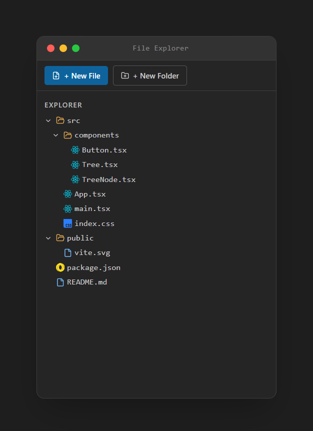

<div align="center">

# 🗂️ StoreBox File Explorer

**A fully interactive VS Code–style file explorer built with React and Tailwind CSS.**

Supports unlimited nesting · inline rename · two-click delete confirmation · smooth animations

<br />

[](https://react.dev)
[](https://tailwindcss.com)
[](https://lucide.dev)
[](LICENSE)

</div>

---

## 📖 Introduction

StoreBox File Explorer is a React component project that faithfully recreates the sidebar file tree experience from Visual Studio Code — dark theme, traffic-light title bar, chevron toggles, hover actions, and inline editing — entirely in the browser with no third-party tree libraries.

It was built as a study in **recursive component design**, **immutable state management**, and **clean separation of concerns** across a multi-file component architecture.

---

## ✨ Features

| Feature | Details |
|---|---|
| 📁 **Create files & folders** | At the root level or nested inside any folder |
| ✏️ **Inline rename** | Pre-fills the existing name, cursor jumps to end — just like VS Code |
| 🗑️ **Delete with confirmation** | Custom confirmation modal before deleting files/folders |
| 📂 **Expand / collapse folders** | Animated max-height + opacity transition |
| ♾️ **Unlimited nesting** | Recursive `TreeNode` rendering with no depth limit |
| 🎯 **Keyboard support** | `Enter` to confirm, `Escape` to cancel on all inputs |
| 💬 **Empty states** | Per-folder "empty folder" hint + root empty state with icon |
| 🖱️ **Hover actions** | Rename / delete (+ new file / new folder on folders) appear on hover |
| 🎨 **Extension-based file icons** | `.jsx`, `.js`, `.html`, `.css`, `.json`, etc. show matching technology icons |
| 🍎 **macOS window chrome** | Traffic-light dots + centered title bar |

---

## 🔗 Live Demo

> **[▶ View Live Project](https://storebox-explorer7.onrender.com/)**  
> Deployed on Render.

---

## 🛠️ Tech Stack

| Layer | Technology |
|---|---|
| **Framework** | [React 18](https://react.dev) — functional components + hooks only |
| **Styling** | [Tailwind CSS v3](https://tailwindcss.com) — utility-first, no custom CSS |
| **Icons** | [Lucide React](https://lucide.dev) — `Folder`, `File`, `FilePlus`, `Pencil`, `Trash2`, … |
| **State** | React `useState` + `useCallback` — no Redux, no context |
| **Build** | [Vite](https://vitejs.dev) (recommended) |

---

## 📸 Screenshots

 <div align="center">
  
</div>

---

## 📁 Folder Structure

```
storebox-explorer/
│
├── src/
│   │
│   ├── utils/
│   │   ├── tree.js                  #  Pure immutable tree operations (insert / rename / delete)
│   │   └── initialData.js           #  Seed data — the default file tree on first render
│   │
│   ├── hooks/
│   │   └── useTreeState.js          #  Custom hook — owns tree[], exposes stable callbacks
│   │
│   ├── components/
│   │   ├── InlineInput.jsx          #  Auto-focused input used for rename + create
│   │   ├── NodeIcon.jsx             #  Picks the right icon (file / open folder / closed folder)
│   │   ├── NodeActions.jsx          #  Hover action bar; owns its own confirmDelete state
│   │   ├── TreeNode.jsx             #  Recursive row — renders one node and its children
│   │   ├── Toolbar.jsx              #  Top bar with "New File" and "New Folder" buttons
│   │   ├── TitleBar.jsx             #  macOS-style traffic-light window chrome
│   │   └── Explorer.jsx             #  Assembles Toolbar + label + scrollable tree
│   │
│   └── App.jsx                      #  Root — wires useTreeState into Explorer
│
└── README.md
```

---


## 🚀 Installation & Setup

### Prerequisites
- Node.js ≥ 18
- npm or pnpm

### 1 — Clone the repo

```bash
git clone https://github.com/Sreenand76/storebox-explorer.git
```

### 2 — Install dependencies

```bash
npm install
```

### 3 — Start the dev server

```bash
npm run dev
```

Open [http://localhost:5173](http://localhost:5173) in your browser.

### 4 — Build for production

```bash
npm run build
```

---

## 🔮 Future Improvements

- [ ] **Drag and drop** — move files/folders by dragging between nodes
- [ ] **Cut / Copy / Paste** — keyboard shortcuts `Ctrl+X`, `Ctrl+C`, `Ctrl+V`
- [ ] **Multi-select** — `Shift+Click` and `Ctrl+Click` to select multiple nodes
- [ ] **Context menu** — right-click menu mirroring VS Code's sidebar menu
- [ ] **Search / filter** — fuzzy search bar that highlights matching filenames
- [ ] **Persistence** — save the tree to `localStorage` or a backend API
- [ ] **Undo / redo** — `Ctrl+Z` support via a history stack
- [ ] **Breadcrumb bar** — show the path of the currently selected file
- [ ] **Accessibility** — full keyboard navigation and ARIA roles for screen readers

---

## 📄 License

MIT © 2026 — free to use, fork, and modify.

---


